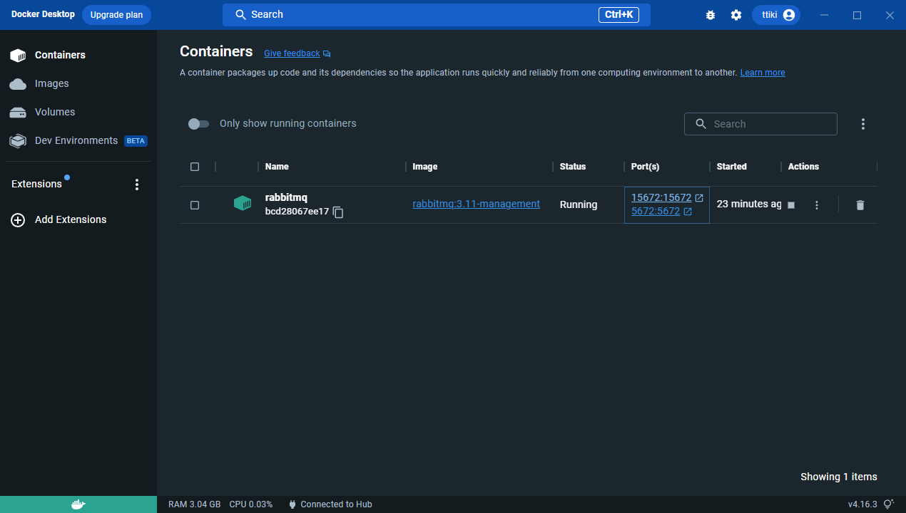

# eip-lab4a

Ce lab vise à appliquer le modèle de style d'intégration de messagerie EIP basé sur l'utilisation du courtier de messages RabbitMQ.

Ce cinquième lab apporte le concept de système de messagerie. Nous n'avons plus besoin d'importer les données du producteur dans le consommateur. En effet, les informations sont directement envoyées sur un serveur auquel nous avons abonné notre consommateur. Dès que le producteur envoie des données, le serveur notifie le consommateur qui vient récupérer les informations du serveur.

Nous utilisons RabbitMQ pour ce lab afin de visualiser les requêtes et les réponses. Pour plus d'informations sur l'installation et l'utilité, lisez la partie "Installation" de ce README.

### RabbitMQ & Docker

Pour simplifier la tâche, nous allons utiliser Docker pour lancer le serveur RabbitMQ. Pour cela, vous devez avoir Docker installé sur votre machine. Si ce n'est pas le cas, veuillez suivre les instructions suivantes :

1. Téléchargez Docker Desktop pour Windows : https://hub.docker.com/editions/community/docker-ce-desktop-windows
2. Ouvrez un terminal et tapez la commande suivante : `wsl --update`
3. Lancez l'installation et suivez les instructions (**ATTENTION, UN REDÉMARRAGE DE VOTRE MACHINE EST NÉCESSAIRE**)
4. Vous pouvez ouvrir Docker Desktop
5. Ouvrez un terminal et tapez la commande suivante : `docker run -it --rm --name rabbitmq -p 5672:5672 -p 15672:15672 rabbitmq:3.11-management`
6. Si vous avez bien suivi les instructions, vous devriez voir un nouveau conteneur dans Docker Desktop.

---

> _Nous n'utilisons pas l'installateur RabbitMQ directement sur notre machine car il est plus simple de lancer un serveur RabbitMQ avec Docker. De plus, cela nous permet de ne pas avoir à installer RabbitMQ sur notre machine, ce qui peut être un peu compliqué (il y a plusieurs choses à installer pour faire fonctionner RabbitMQ...)_ 
